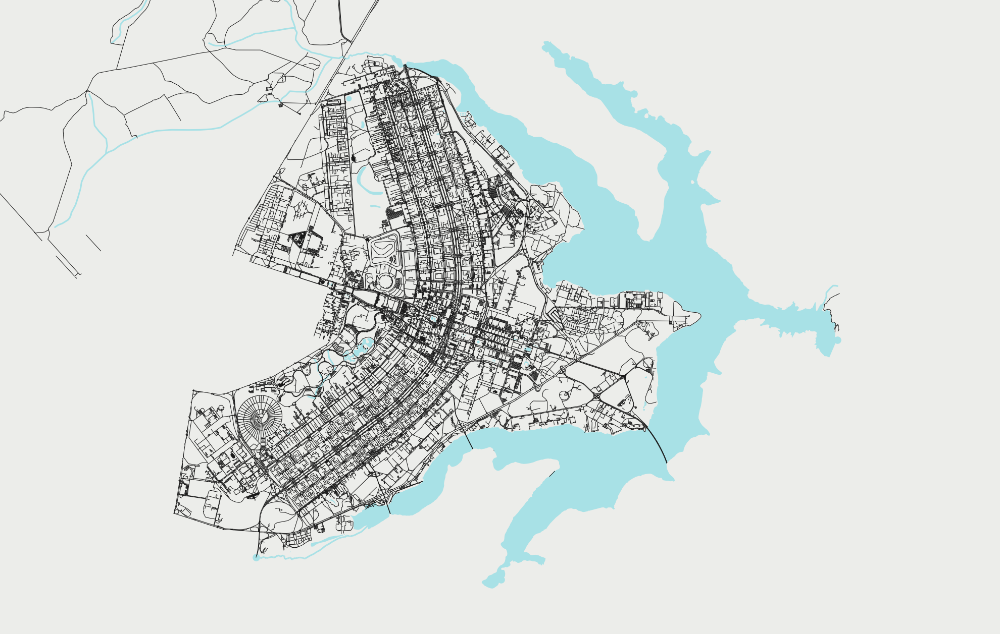

# city-posters

Generate city posters with [Geopandas][geopandas] and [SRAI][srai].



## Setup

Create a conda environment named (`cityposters`) with the following command:

```sh
conda env create -f environment.yml
```

Install all the required dependencies with the following command:

```sh
conda activate cityposters
pip install -r requirements.txt
```

## Usage

See `/making_city_posters.ipynb` for detailed usage examples. Alternatively, you can create your own configuration entry in `/config.py` and create your poster by running

```sh
python make_poster.py -cn <your_config_name>
```

## License

See the `LICENSE` file for more information.

## Acknowledgements

This repository uses the [Spatial Representations for Artificial Intelligence (SRAI)][srai] package, which is a project of [Kraina][kraina], the Geospatial & Mobility Research Group at Wroclaw University of Science and Technology (WUST)

[geopandas]: https://geopandas.org/en/stable/
[kraina]: https://kraina.ai/index.html
[srai]: https://kraina-ai.github.io/srai/latest